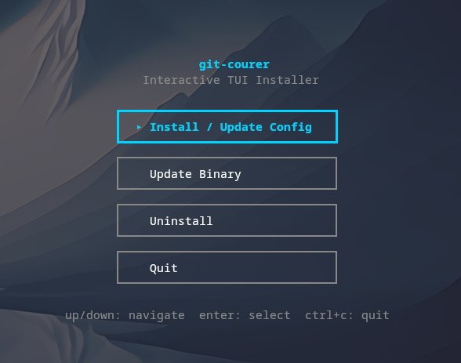

<!-- mcp-name: io.github.Alejandro-M-P/git-courer -->
<!-- markdownlint-disable MD041 -->


<p align="center">
  <a href="https://github.com/Alejandro-M-P/git-courer/releases/latest">
    
  </a>
  <a href="https://github.com/Alejandro-M-P/git-courer/actions">
    
  </a>
  <a href="https://github.com/Alejandro-M-P/git-courer/blob/main/LICENSE">
    
  </a>
</p>

> **Issues & Bugs**: [@Alejandro-M-P/git-courer/issues](https://github.com/Alejandro-M-P/git-courer/issues) · **Discussions**: [@Alejandro-M-P/git-courer/discussions](https://github.com/Alejandro-M-P/git-courer/discussions)

---

## Quick Links

| Doc | Description |
|-----|-------------|
| **[Architecture](docs/architecture.md)** | Codebase structure, patterns, and how to add features |
| **[Troubleshooting](docs/troubleshooting.md)** | Fix: Ollama not running, MCP not detected, permission errors |
| **[MCP Clients](docs/mcp-clients.md)** | All 12 supported clients, config formats, manual setup |
| **[Config Options](docs/config.md)** | All `~/.config/git-courer/config.yaml` and `.git-courer/config.json` settings |
| **[Commands](docs/commands.md)** | Complete reference for all 22 MCP tools |
| **[Models Guide](docs/models.md)** | Tested models, token usage, and which one to pick |
| **[Contributing](CONTRIBUTING.md)** | Setup, running tests, and how to collaborate |

---

# git-courer

**The only MCP git server that understands your code before it commits.**

Most tools wrap `git diff | llm "write a commit"`. git-courer does something different: it parses your AST, builds a dependency graph, classifies the change type in Go without touching the LLM, and only calls the model to write the human-readable message.

> One staged area = one commit. Always.

---

## Why it's different

### 1. Commit type determined in Go, not by the LLM
git-courer uses go-enry and go-tree-sitter to parse your AST and apply deterministic rules — new public function, modified signature, deleted symbol, breaking change. The LLM writes the message, not the decision.

### 2. Dependency graph
Before committing, git-courer builds a graph of what your staged files affect across the codebase. Real scope, not just which files were touched.

### 3. Local + cloud working together
Go and the local LLM handle everything they can. Your cloud LLM receives structured commit context — WHY + WHAT — instead of raw code.

### 4. Commits as LLM context
A git-courer commit is a compressed, structured summary any LLM can consume directly. Better input, fewer tokens, fewer hallucinations.

### 5. Automatic backup on every mutation
Every write operation creates a backup before executing. One command undoes anything.

### 6. The complete git pack — one server, nothing else needed
Why install one tool for commits, another for releases, another for PR checks? git-courer covers the full cycle:

**Read:** status, diff, history, blame, pr-review  
**Write:** commit, amend, revert, stage, reset, stash  
**Branch:** branch, merge, rebase, cherry-pick, tag  
**Utility:** sync, backup, undo, remotes, config

All returning structured JSON. No pager hangs, no text parsing, no extra tools.

---

## Workflows

### Commit
Preview the change → review proposed commits → apply. git-courer splits your staged files into atomic commits by dependency graph automatically.

### Before any PR or merge
Call `pr-review` — a pre-PR gate that runs in one shot:
1. **Tests** — runs `test_command` from `.git-courer/config.json` (e.g. `go test ./...`)
2. **Conflicts** — detects merge conflicts with the target branch and returns AST-annotated hunks (`[NEW_FUNC]`, `[MOD_SIG ⚠BREAKING]`)
3. **Diff stats** — files changed, additions, deletions
4. **Divergence** — ahead/behind count, mergeable status

If it's not green, you don't merge. Set `test_command` via `git-config SET_TEST_COMMAND` or edit `.git-courer/config.json` directly.

### Release (CLI)
Run `git-courer release`. The CLI reads commits from `.git-courer/commits.json` (captured during each `git-commit APPLY` on this branch) and groups them by the `areas` defined in `.git-courer/config.json`. If the branch store is empty, it falls back to `git log` since the last tag. Go calculates the version bump; the local LLM writes the human-readable changelog per area.

### Undo
Every destructive operation has an automatic backup. One command restores the previous state.

---

## How it works

```
You: "commit my changes"
        ↓
AI delegates to git-courer (via MCP)
        ↓
Go reads AST + dependency graph → classifies type deterministically
        ↓
Local LLM writes the human-readable message from the annotated diff
        ↓
Security scan (5 layers) → auto-backup → commit
        ↓
"✓ feat(auth): add OAuth2 token refresh"
```

For the full list of tools: [docs/commands.md](docs/commands.md)  
For workflow details: [docs/workflows.md](docs/workflows.md)

---

## Install

```bash
curl -fsSL https://raw.githubusercontent.com/Alejandro-M-P/git-courer/main/scripts/install.sh | sh
```

That's it. It installs the binary and auto-configures every AI tool it detects on your machine.

**Requirements:** Git · [Ollama](https://ollama.com) (optional, for AI commit messages)

**Manual install:**
```bash
# macOS / Linux
curl -fsSL https://github.com/Alejandro-M-P/git-courer/releases/latest/download/git-courer_$(uname -s | tr '[:upper:]' '[:lower:]')_$(uname -m).tar.gz | tar -xz -C /usr/local/bin git-courer
chmod +x /usr/local/bin/git-courer
git-courer setup

# Windows (PowerShell)
irm https://github.com/Alejandro-M-P/git-courer/releases/latest/download/git-courer_windows_amd64.tar.gz | tar -xz -o git-courer.exe
.\git-courer.exe setup

# Or with Go
go install github.com/Alejandro-M-P/git-courer@latest
```

## Supported Tools

| Tool | Auto-configured |
|------|----------------|
| Claude Code | ✓ |
| Cursor | ✓ |
| Windsurf | ✓ |
| OpenCode | ✓ |
| Cline | ✓ |
| Roo Code | ✓ |
| VS Code | ✓ |
| Claude Desktop | ✓ macOS/Win only |
| Continue | ✓ |
| Zed | ✓ |
| Codex | ✓ |
| Gemini CLI | ✓ |

Run `git-courer mcp setup` to configure all detected tools at once, or `git-courer mcp setup <client>` for a specific one.

## Interactive TUI

Run `git-courer` with no arguments to launch the interactive installer:




The TUI walks you through 4 steps:
1. **MCP Configuration** — select which AI tools to configure (auto-detects installed clients)
2. **General Settings** — configure your LLM backend, model, and project context
3. **Review** — preview your config before saving
4. **Finish** — config saved to `~/.config/git-courer/config.yaml`

You can also update the binary or uninstall directly from the menu. Navigation: `j/k` or arrow keys, `esc` to go back.

## Commands

git-courer runs as an interactive TUI when launched without arguments. It also provides MCP server and management commands:

| Command | Description |
|---------|-------------|
| `git-courer` | Launch interactive TUI (requires terminal) |
| `git-courer mcp` | Run MCP server |
| `git-courer mcp setup` | Configure all detected AI tools |
| `git-courer mcp setup <client>` | Configure a specific tool (e.g. `cursor`) |
| `git-courer release` | Automated semver releases and changelogs (CLI only) |
| `git-courer remove` | Remove git-courer from the current project |
| `git-courer uninstall` | Uninstall the binary globally |
| `git-courer update` | Update to the latest version |
| `git-courer version` | Show current version |

### MCP Tools

For the 22 MCP tools and their arguments, see **[docs/commands.md](docs/commands.md)**.

## Configuration

git-courer uses two config levels:

**Global** (`~/.config/git-courer/config.yaml`) — personal settings: LLM backend, model.

**Per-project** (`.git-courer/config.json`) — committable, shared with team. Stores description, areas, test_command, excluded. Better results = edit this file per project.

All options: **[docs/config.md](docs/config.md)**

## Background Jobs

When you call `git-commit PREVIEW`, the server may return immediately (FAST) or start a background job (SLOW). In the SLOW case:

1. PREVIEW returns `{status:"processing", job_id}`
2. The agent must call `git-commit STATUS` with that `job_id` to poll
3. When STATUS returns `{status:"done"}`, the plan is ready
4. Then call `git-commit APPLY` with the same `job_id`

The agent continues working — it does NOT block waiting for the job.

Every successful commit via `git-commit APPLY` is captured to `.git-courer/commits.json` (branch-scoped under `.git-courer/branches/<branch>/commits.json`). When you later run `git-courer release`, the CLI reads those captured commits — grouped by the `areas` defined in `.git-courer/config.json` — to generate the changelog. No re-parsing `git log`.

**Why this matters:** Git history is frequently rewritten — PR squashes, rebases, force-pushes — destroying the real commit narrative. The CommitStore preserves every commit message as it was written, independently of what happens on the remote. Your release changelog survives `git log` being flattened into a single squashed commit. This is local documentation that outlives git history rewriting.

## Troubleshooting

Having issues? Check **[docs/troubleshooting.md](docs/troubleshooting.md)** for:
- Ollama not running / model not configured
- MCP not detected by your AI tool
- Permission errors during install
- Secrets detected in commits (false positives)

MCP config file locations: **[docs/mcp-clients.md](docs/mcp-clients.md)**

---

## FAQ

**Who decides the commit type?**
Go, via AST analysis. The LLM only writes the human-readable message.

**Do I need Ollama?**
You need *some* LLM backend. Ollama is the recommended default, but git-courer works with any OpenAI-compatible server: LM Studio, vLLM, LocalAI, or a custom endpoint. Without a configured backend, all AI operations (commits, releases, branch names, security auditor) fail. Basic git reads (status, diff, log) still work.

**Is my code sent anywhere?**
No. Everything runs on your machine — git-courer, Ollama, your data.

**Who decides the version number in a release?**
Go, not Ollama. Version is calculated from commit types (`feat:` → minor, `feat!:` → major). Ollama only writes the human changelog.

**My tool isn't listed.**
Open an issue: [@Alejandro-M-P/git-courer/issues](https://github.com/Alejandro-M-P/git-courer/issues). If it supports MCP, adding it is usually a few lines.

**How do I mark a breaking change?**
Use `!` after the commit type (`feat!:`) or include `BREAKING CHANGE:` in the body. git-courer picks this up automatically for version bumping and changelog generation.

---

## Contributing

Want to collaborate? Here's everything you need:

### Architecture & Codebase

Read **[docs/architecture.md](docs/architecture.md)** for:
- Directory structure and tech stack
- Hexagonal architecture patterns
- Key packages and their responsibilities
- How to add a new feature
- Testing approach

### Reporting Bugs

Found a bug? Open an issue: **[@Alejandro-M-P/git-courer/issues](https://github.com/Alejandro-M-P/git-courer/issues)**

Include:
- Your OS and git-courer version (`git-courer version`)
- AI tool you're using (Claude Code, Cursor, etc.)
- Steps to reproduce
- Relevant logs or error messages

### How to Collaborate

1. **Read the docs**: Start with [docs/architecture.md](docs/architecture.md) and [CONTRIBUTING.md](CONTRIBUTING.md)
2. **Pick an issue**: Check [@Alejandro-M-P/git-courer/issues](https://github.com/Alejandro-M-P/git-courer/issues) for `good first issue` labels
3. **Discuss**: Use [@Alejandro-M-P/git-courer/discussions](https://github.com/Alejandro-M-P/git-courer/discussions) for questions or feature ideas
4. **Submit PR**: Follow conventional commits (`feat:`, `fix:`, `chore:`)

### Adding a New MCP Client

If your AI tool supports MCP but isn't listed, adding it is usually **5 lines of code** in `internal/installer/mcp_config.go`. See [docs/mcp-clients.md](docs/mcp-clients.md) for the format.
